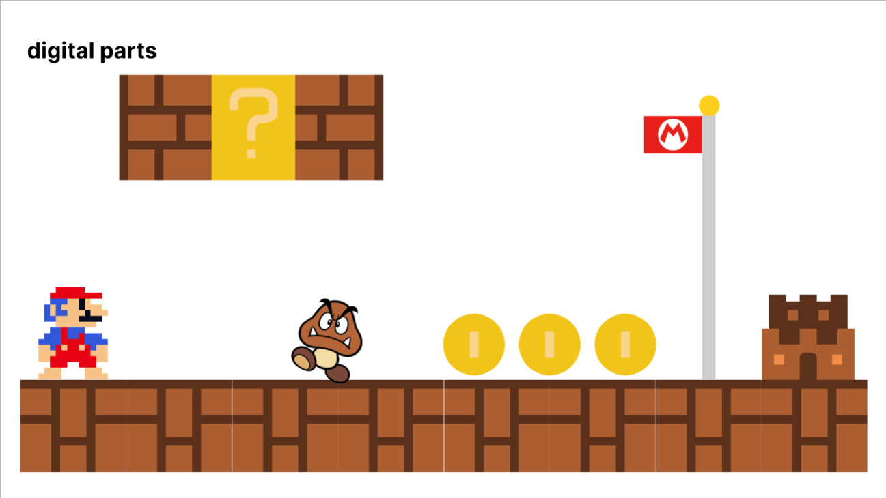
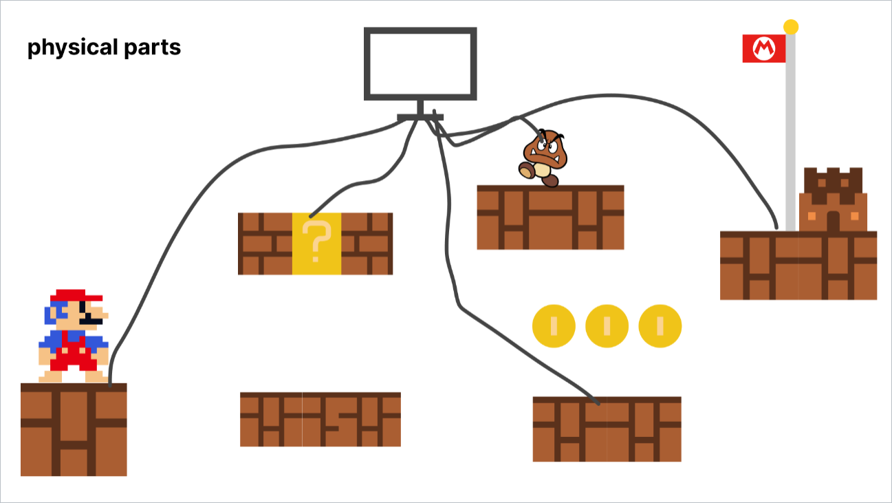

## Final Project
### Final Project description:  
In this final project, I decided to take my midterm project further and make it more refined. 

I retained the original Mario flag mechanics, while aiming to enhance the gameplay and interactivity of the project. I plan to design devices that represent various items, structures, and enemies from the Mario games. These devices will be connected to a computer, and by reading the signals from the devices, corresponding text, images, and sounds will be output.

### Concept Sketches:  
  
  

### State Diagram:  
The program operates in two main parts. The first part involves the Atom board, which is responsible for receiving the button states and outputting signals to change the servo's model and the button states. The second part involves the computer, which reads the button signals printed by the Atom board and outputs images, text, and sounds based on those signals.

  

### Hardware:  
* ATOM s3
* wires
* 360 servo
* MDF
* copper foil tape
* Paperboard
* Lego pieces

  

### Firmware:
[Final Project ATOM Code Link1](test.py)  
[Final Project P5 Code Link2](main.py)  

First, we need four button inputs, and connect button 4 to a 360 servo. When button 4 is pressed, the servo will start rotating to adjust the position of the flag.

```Python
while True:
    M5.update()

    button1_val = button1.value()
    button2_val = button2.value()
    button3_val = button3.value()
    button4_val = button4.value()

    print(button1_val, ',', button2_val, ',', button3_val, ',', button4_val)

    if previous_button4_state == 1 and button4_val == 0: 
        if current_state == 0:
            #print("Button 4 pressed: Setting duty cycle to 65.")
            pwm1.duty(69) 
            time.sleep(2)  
            #print("Stopping servo.")
            pwm1.duty(0)  
            current_state = 1  
        elif current_state == 1:
            #print("Button 4 pressed: Setting duty cycle to 85.")
            pwm1.duty(85)  
            time.sleep(2)  
            #print("Stopping servo.")
            pwm1.duty(0)  
            current_state = 0  

    previous_button4_state = button4_val

    time.sleep(0.1)
```

Next, we need to have p5 read the value of each button and change the program state based on the button values.
And set what will be present on the screen for each state.

```Python
if program_state == 'TITLE':
        if p5.millis() > 3000:
          if not sound_played_title:
            print('play sound')
            #sound_mario.play()
            sound_title.play()  
            sound_played_title = True
        p5.background(000)
        p5.image(title_img, p5.width / 2, p5.height / 3, 300, 150)  
        p5.fill(255)
        p5.text('Start', p5.width / 2, 2 * p5.height / 3) 
    
    if program_state == 'DICE':
      if random_number is not None:
          p5.fill(0)
          p5.text(f"{random_number} Step", p5.width / 2, p5.height / 2)

    if program_state == 'QUESTION':
      if random_image is not None:
          p5.image(random_image, p5.width / 2, p5.height / 2, 100, 100)

    if program_state == 'SCORE':
        p5.fill(0, 255, 0)
        p5.text("+10 Points", p5.width / 2, p5.height / 2)

    if program_state == 'WIN':
        p5.image(win_img, p5.width / 2, p5.height / 2, 300, 200)  
        p5.fill(255, 0, 0)
        p5.text("You Win", p5.width / 2, p5.height / 2)
```

### Physical Components:
I chose MDF as the main material and used a laser cutter to cut out the shapes I needed, then assembled them using super glue. For the wiring connections, I used copper foil tape as the contact points for the buttons and extended them with cardboard. This allowed me to use wires with clips to connect them to my ATOM S3. I also cut some MDF pieces and used them as bridges to connect various components.


### Project outcome:
I designed a gameplay similar to Monopoly, where players use a digital dice to determine how many spaces to move each turn. I also created some devices that trigger images, text, and sound effects when players interact with them. The player's goal is to reach the flag to achieve the final victory in the game.
[Video for the outcome](outcome.mp4)  


