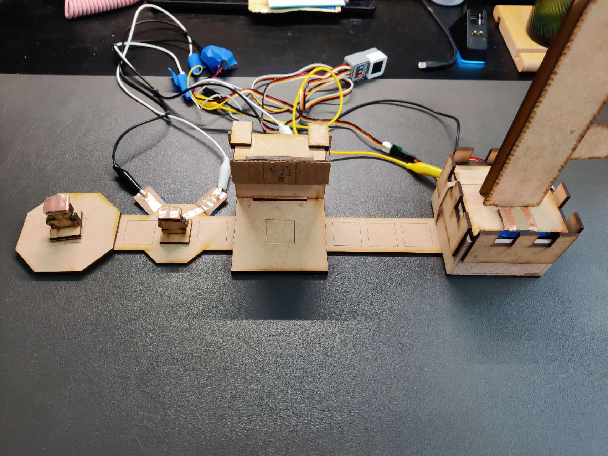

## Assignment 01
### Assignment 1 description:  
In this final project, I decided to take my midterm project further and make it more refined. 

I retained the original Mario flag mechanics, while aiming to enhance the gameplay and interactivity of the project. I plan to design devices that represent various items, structures, and enemies from the Mario games. These devices will be connected to a computer, and by reading the signals from the devices, corresponding text, images, and sounds will be output.

### Concept Sketches:  
  

### State Diagram:  
The program operates in two main parts. The first part involves the Atom board, which is responsible for receiving the button states and outputting signals to change the servo's model and the button states. The second part involves the computer, which reads the button signals printed by the Atom board and outputs images, text, and sounds based on those signals.

  

### Hardware:  
* ATOM s3
* wires
* 360 servo
* MDF
* copper foil tape
* Paperboard
* Lego pieces

  

### Firmware:
[Assignment 1 Code Link](hw.py)  

First, we need to set two different functions for two statuses, The first one is to keep a red light when the weapon is not on the base support, and the other one is RGB looping when the gun is on the base. Then we need to write a looping function to switch these two status by getting the value from pin 7.  

```Python
while True:
    M5.update()

    button1_val = button1.value()
    button2_val = button2.value()
    button3_val = button3.value()
    button4_val = button4.value()

    print(button1_val, ',', button2_val, ',', button3_val, ',', button4_val)

    if previous_button4_state == 1 and button4_val == 0: 
        if current_state == 0:
            #print("Button 4 pressed: Setting duty cycle to 65.")
            pwm1.duty(69) 
            time.sleep(2)  
            #print("Stopping servo.")
            pwm1.duty(0)  
            current_state = 1  
        elif current_state == 1:
            #print("Button 4 pressed: Setting duty cycle to 85.")
            pwm1.duty(85)  
            time.sleep(2)  
            #print("Stopping servo.")
            pwm1.duty(0)  
            current_state = 0  

    previous_button4_state = button4_val

    time.sleep(0.1)
```

First, we need to set two different functions for two statuses, The first one is to keep a red light when the weapon is not on the base support, and the other one is RGB looping when the gun is on the base. Then we need to write a looping function to switch these two status by getting the value from pin 7.  

```Python
while True:
    M5.update()

    button1_val = button1.value()
    button2_val = button2.value()
    button3_val = button3.value()
    button4_val = button4.value()

    print(button1_val, ',', button2_val, ',', button3_val, ',', button4_val)

    if previous_button4_state == 1 and button4_val == 0: 
        if current_state == 0:
            #print("Button 4 pressed: Setting duty cycle to 65.")
            pwm1.duty(69) 
            time.sleep(2)  
            #print("Stopping servo.")
            pwm1.duty(0)  
            current_state = 1  
        elif current_state == 1:
            #print("Button 4 pressed: Setting duty cycle to 85.")
            pwm1.duty(85)  
            time.sleep(2)  
            #print("Stopping servo.")
            pwm1.duty(0)  
            current_state = 0  

    previous_button4_state = button4_val

    time.sleep(0.1)
```

### Physical Components:
To make the toy gun work as a digital input, I need to add something to connect it to the breadboard. So I use copper foil tape to tape the button of the gun and the part of the base that holds the gun. So when I place the gun on the base, it will work like a button.  


### Project outcome:
Finally, I made it work. When the gun is not on the base the RGB strip will keep glowing red light, and when I place the gun on the base, the RGB strip will start looping different color lights.
[Video for the outcome](outcome.mp4)  


