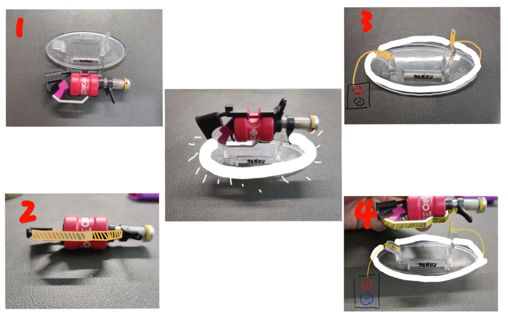
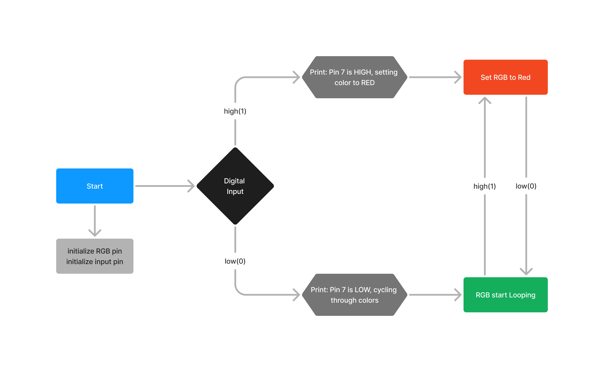

## Assignment 01
### Assignment 1 description:  
In this assignment, we are required to find an object in real life and transform it into a digital input, then connect it to an RGB light strip. This digital input can change the output, which is the state of the RGB light strip.  

For this, I found a toy gun from a video game, which consists of the gun itself and its base. My idea is that when the weapon is not on the base, the RGB light strip will continuously emit red light, and when I place the gun on the base, the RGB light strip will start cycling through different colors.  

### Concept Sketches:  
  

### State Diagram:  
When running the program initialize the RGB pin and input pin. When the value from digital input is high/1, print: Pin 7 is HIGH, setting color to RED and set RGB strip to red color. Else print: Pin 7 is LOW, cycling through colors and setting RGB strip color to start looping different colors.  

  

### Hardware:  
* ATOM s3
* wires
* RGB Strip
* toy gun and its base support

[Repository README LINK](../README.md)  
[Assignment 1 Code Link](hw.py)  
```Python
while True:
    M5.update()  

    if input_pin.value() == True:  
        print('Pin 7 is HIGH, setting color to RED')
        rgb_strip.fill_color(0xff0000)  
    else:  
        print('Pin 7 is LOW, cycling through colors')
        color_cycle()

    time.sleep_ms(100)
```  
Image link example:

List example  
* list 1
* list 2
* list 3
