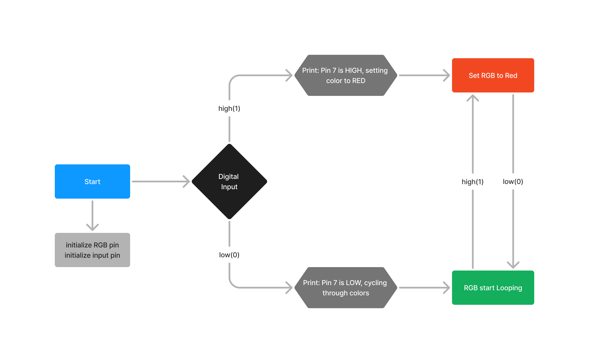

## Assignment 1
Assignment 1 description  
[Repository README LINK](../README.md)  
[Assignment 1 Code Link](hw.py)  
```Python
while True:
    M5.update()  

    if input_pin.value() == True:  
        print('Pin 7 is HIGH, setting color to RED')
        rgb_strip.fill_color(0xff0000)  
    else:  
        print('Pin 7 is LOW, cycling through colors')
        color_cycle()

    time.sleep_ms(100)
```  
Image link example:
  

List example  
* list 1
* list 2
* list 3
