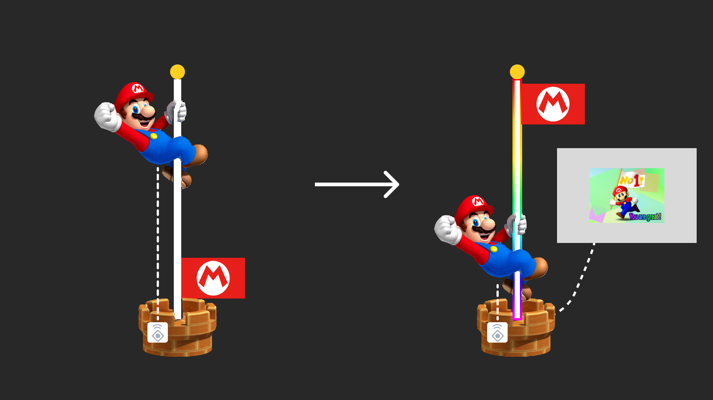

## Assignment 02
### Assignment 2 description:  
In this assignment, we are required to find an object in real life and transform it into a digital input, then connect it to an RGB light strip. This digital input can change the output, which is the state of the RGB light strip.  

For this, I found a toy gun from a video game, which consists of the gun itself and its base. My idea is that when the weapon is not on the base, the RGB light strip will continuously emit red light, and when I place the gun on the base, the RGB light strip will start cycling through different colors.  

### Concept Sketches:  
  

### State Diagram:  
When running the program initialize the RGB pin and input pin. When the value from digital input is high/1, print: Pin 7 is HIGH, setting color to RED and set RGB strip to red color. Else print: Pin 7 is LOW, cycling through colors and setting RGB strip color to start looping different colors.  

  

### Hardware:  
* ATOM s3
* wires
* RGB Strip
* toy gun and its base support
* copper foil tape

  

### Firmware:
[Assignment 1 Code Link](hw.py)  

First, we need to set two different functions for two statuses, The first one is to keep a red light when the weapon is not on the base support, and the other one is RGB looping when the gun is on the base. Then we need to write a looping function to switch these two status by getting the value from pin 7.  

```Python
while True:
def get_rgb_color(r, g, b):
    rgb_color = (r << 16) | (g << 8) | b
    return rgb_color


def color_cycle():
    colors = [(255, 0, 0), (0, 255, 0), (0, 0, 255), (255, 255, 0), (0, 255, 255), (255, 0, 255)]
    for r, g, b in colors:
        rgb_strip.fill_color(get_rgb_color(r, g, b))
        time.sleep_ms(500)  

while True:
    M5.update()  

    if input_pin.value() == True:  
        print('Pin 7 is HIGH, setting color to RED')
        rgb_strip.fill_color(0xff0000)  
    else:  
        print('Pin 7 is LOW, cycling through colors')
        color_cycle()

    time.sleep_ms(100)  
```

### Physical Components:
To make the toy gun work as a digital input, I need to add something to connect it to the breadboard. So I use copper foil tape to tape the button of the gun and the part of the base that holds the gun. So when I place the gun on the base, it will work like a button.  


### Project outcome:
Finally, I made it work. When the gun is not on the base the RGB strip will keep glowing red light, and when I place the gun on the base, the RGB strip will start looping different color lights.
[Video for the outcome](outcome.mp4)  


