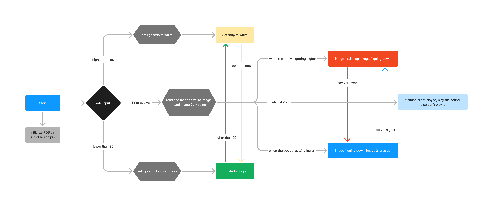
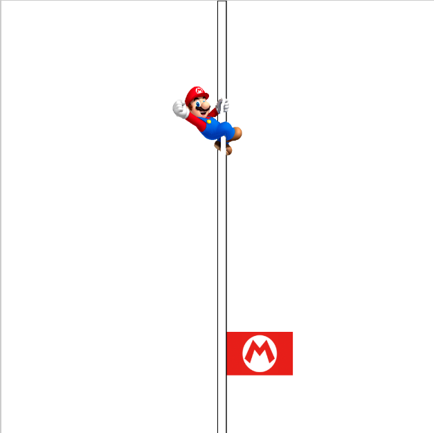
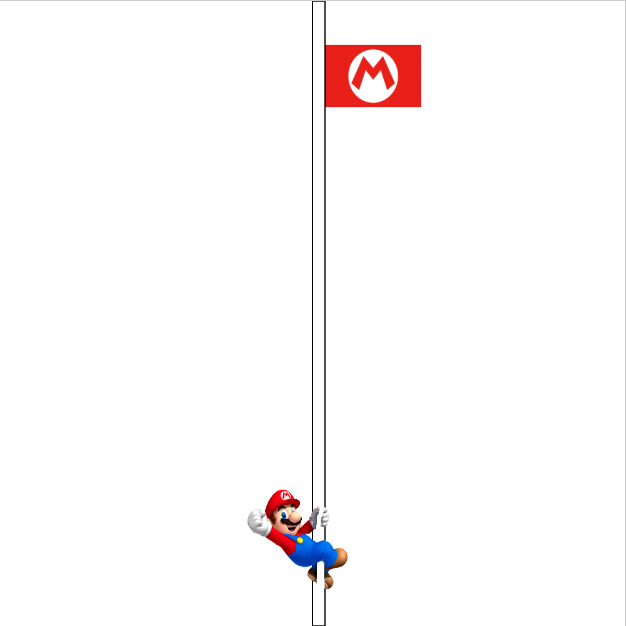

## Assignment 02
### Assignment 2 description:  
In this assignment, we were required to use an ADC sensor as an input and have several different output methods. I chose an RGB LED strip as the physical output. After connecting it to the web file, digital outputs are represented on the screen as visuals and sound.

To achieve this, I designed a toy inspired by the flag in the Super Mario game. When the user pulls Mario down, the flag on the other side rises. At the same time, the distance sensor beneath Mario triggers changes in the RGB LED strip's colors and updates the content on the webpage based on the distance.

### Concept Sketches:  
  

### State Diagram:  
When running the program initialize the RGB pin and adc pin. When ADC value is higher than 90 set RGB led strip to white, When the value is lower than 90, the strip will start looping different colors. And the same time it will print the value from ADC, when you connect to the web program, the program will read the value to control the images on the web program. When the value gets higher the image 1 will rise up and image 2 will go down, and when the value gets lower, the image 1 will go down the image 2 will rise up. At the same time, if the value go under 90, a sound will be play.

  

### Hardware:  
* ATOM s3
* wires
* RGB Strip
* MDF boards
* distance senser

### Firmware:
[Assignment 2 Code for ATOM S3 Link](code.py)  

First, we need to set two different functions for two statuses, The first one is to keep make the strip glow white light when the value is higher than 90, and the other one is RGB looping when the value is lower than 90. Then we need to write a looping function to switch these two status by getting the value from adc.  

```Python
def color_cycle():
    global rgb_timer
    global colors_counter
    if (time.ticks_ms() > rgb_timer + 400):
        #for r, g, b in colors:
        r, g, b = colors[colors_counter]
        rgb = get_rgb_color(r, g, b)
        rgb_strip.fill_color(rgb)
        #rgb_strip.fill_color(get_rgb_color(r, g, b))
        #time.sleep_ms(400)
        if (colors_counter < len(colors)-1):
            colors_counter += 1
        else:
            colors_counter = 0
        # update timer:
        rgb_timer = time.ticks_ms()

while True:
    M5.update()
    
    # Read ADC value and map it to range 0-255
    adc_val = int(m5utils.remap(adc.read(), 0, 4095, 0, 255))
    
    # Conditional color change based on ADC value
    if adc_val < 90:
        color_cycle()
        
    else:
        rgb_strip.fill_color(0xffffff)
    
    # Print ADC value
    print(adc_val)
    
    # Delay to prevent data overload
    time.sleep_ms(50)
```

[Assignment 2 Code for Web Link](main.py)  

For the web Program, we need to make two image moves on the y-axis based on the ADC value, and when the value goes under 90, a sound will be triggered.

```Python
def draw():
    global sound_played
    p5.background(255)

    global data
    
    data = document.getElementById("data").innerText

    
    data_value = int(data)

    y_position = p5.map(data_value, 0, 200, 420, 0)  

    opposite_y_position = p5.map(data_value, 0, 200, 0, 500)

    

    p5.image(flag_img, 260, opposite_y_position, 77, 50)  

    p5.rect(250, 0, 10, 500)

    p5.image(mario_img, 198, y_position, 80, 80)  

    

    if p5.millis() > 3000:
        if data_value < 90:
            #if not sound.isPlaying():
            if not sound_played:
                sound.play()
                sound_played = True
        else:
            sound_played = False
```

### Physical Components:
I use MDF for the main structure to build the whole thing, and I can put my LED strip and the wires in the base. Then I used a rubber band to connect Mario and the flag. I added a piece of MDF under the Mario so the distance sensor can trace it.


### Project outcome:
Finally, I made it work. When I drag the Mario down, the flag will rise up and the Mario and flag on the web program will do the same thing. When Mario reaches the base, the strip starts looping colors and a sound effect will be played from the web program.
[Video for the outcome](outcome.mp4)  





